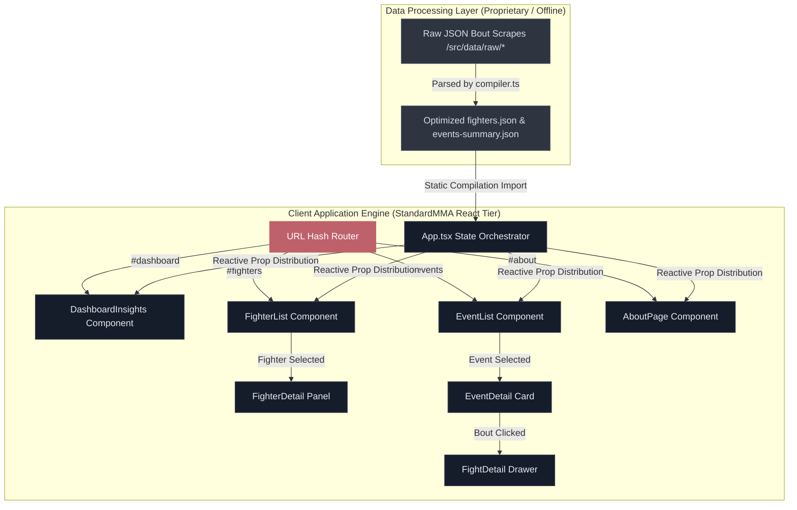

# StandardMMA 🥋

**Live Demo:** [https://examplesofmywork.com/standard-mma/](https://examplesofmywork.com/standard-mma/)

StandardMMA is an interactive, professional-grade tracker and analytics platform for Mixed Martial Arts. Designed as a high-performance Combat Sports Intelligence System, it processes and visualizes fight statistics, fighter profiles, and event details to deliver an elegant, data-driven experience.

---

## 🌟 Key Features

### 📊 1. Interactive Combat Sports Dashboard
- **Executive Insights**: Access a global birds-eye-view of fight datasets, including active champions, total events tracked, and general fight trends.
- **Dynamic Demographics**: Visual breakdowns of weight classes, stance distributions (Orthodox, Southpaw, Switch), and win-method distributions.
- **Champions Showcase**: Interactive display of reigning division champions across weight brackets.

### 👤 2. Fighter Profiles & Deep Stats
- **Advanced Filtering**: Instantly search and filter fighters by name, weight class, stance, or status.
- **Physical Profiles**: View exact measurements for reach, height, age, and weight.
- **Fight Histograms & Metrics**: Deep breakdown of a fighter's career, including detailed win/loss histories, visual streaks, and physical advantages.
- **Adaptive Visualizations**: Comparative stat cards that highlight matchup discrepancies with pristine text legibility.
- **Interactive Matchup Previews**: Profile headshots within fight predictive simulations are fully interactive, enabling seamless deep-linking navigation straight to fighter profiles.

### 📅 3. Comprehensive Event & Card Logs
- **Dynamic Card Discovery**: Look up events by city, venue, or card name with a streamlined search system.
- **Deep Fight Details**: Browse the complete fight order (Main Card, Prelims, Early Prelims) with live results, fight durations, and referee details.
- **Round-by-Round Breakdown**: Explore striking metrics, takedown statistics, and method details for individual bouts.

### 🔗 4. Persistent URL Routing & Deeplinking
- **State-Synchronized Routing**: Built on a solid URL-hash navigation engine (`#dashboard`, `#fighters/:id`, `#events/:id`, `#fights/:id`, `#about`) for native back/forward button behavior and easy link sharing.
- **Top-Scroll Restoration**: Clicking the active navigation tab smoothly scroll-restores the viewport to the top of the current page.
- **Header-Mounted About Portal**: Responsive header triggers on mobile, tablet, and desktop viewports route users directly to system specifications.

### 🎨 5. Cohesive System Aesthetics & Information Page
- **Violet Accent Palette**: A beautifully integrated Violet color scheme replaces flashy colors to deliver a highly integrated, eye-safe combat intelligence vibe.
- **Technical Blueprint Screen**: A dedicated custom information sub-screen (`AboutPage`) fully details the system tech stack, compiler latency, database cache numbers, and visual stages of the pipeline.

---

## 🛠️ Technology Stack

- **Framework**: [React 18](https://react.dev/) + [Vite](https://vite.dev/) for sub-millisecond hot development reload.
- **Styling**: [Tailwind CSS](https://tailwindcss.com/) using a custom premium **slate dark theme** with high-contrast red accents.
- **Animations**: [Framer Motion](https://www.framer.com/motion/) for fluid page transitions, layout-aware modal animations, and interactive drawer slides.
- **Icons**: [Lucide React](https://lucide.dev/) for a consistent, crisp vector design icon language.
- **Typography**: Space Grotesk/Inter and JetBrains Mono for data-dense telemetry.

---

## 📂 Project Structure

```bash
├── src/
│   ├── App.tsx                 # Core application controller and routing orchestrator
│   ├── types.ts                # TypeScript interfaces, enums, and shared data schemas
│   ├── main.tsx                # Client-side mounting entry point
│   ├── index.css               # Global styling, Tailwind imports, and custom scrollbar rules
│   │
│   ├── components/             # Reusable UI components
│   │   ├── DashboardInsights.tsx  # Dynamic dashboard visualizations and champion lists
│   │   ├── FighterList.tsx        # Search, filter controls, and list of all fighters
│   │   ├── FighterDetail.tsx      # Comprehensive physical, historical, and stats detail views
│   │   ├── EventList.tsx          # Card/Event listing, filtering, and venue index
│   │   ├── EventDetail.tsx        # Card-specific details, match card grids, and match statuses
│   │   ├── FightDetail.tsx        # Round-by-round analytics and strike telemetry
│   │   └── AboutPage.tsx          # Technical specifications, stack details, and pipeline blueprint
│   │
│   ├── data/                   # Dynamic sports datasets (JSON)
│   │   ├── raw/                # Extracted individual raw bout and fighter cards (excluded from VCS)
│   │   ├── events-summary.json # Compiled events list
│   │   └── fighters.json       # Compiled fighter records
│   └── compiler.ts             # Sports dataset compilation and parsing tool
│
├── public/                     # Static media assets and custom icons
├── package.json                # Project dependencies and deployment tasks
└── vite.config.ts              # Bundler configuration
```

---

## ⚠️ Proprietary Data & Local Execution Notice

> [!IMPORTANT]
> **This repository is a frontend presentation tier and analytics showcase.** The underlying Combat Sports Intelligence dataset (including detailed bout-by-bout telemetry, career history catalogs, and processed event logs) is **proprietary** and is excluded from this public version.
> 
> As a result, **this project is not to be run locally**, as the raw and processed database JSON records are missing. This repository is published strictly for code-style inspection, architectural evaluation, and design reference.

---

## 🎨 System Architecture & Data Flow

StandardMMA uses an offline-first static data model to achieve instantaneous layout changes and sub-millisecond query responses. The diagram below illustrates how raw statistics are processed and how client state routing maps to individual analytics panels.

### Visual Architecture Diagram



### Static Data Flow Layout

```text
                     +---------------------------------------+
                     |        PROPRIETARY DATA ENGINE        |
                     |  (Excluded from Public Repository)    |
                     +---------------------------------------+
                                         |
                                         | Processed & Compiled
                                         v
                     +---------------------------------------+
                     |  OPTIMIZED DATA CATALOGS (.json)      |
                     |  - fighters.json                      |
                     |  - events-summary.json                |
                     +---------------------------------------+
                                         |
                        Loads statically | into State Engine
                                         v
                     +---------------------------------------+
                     |    App.tsx - REACT STATE CONTROLLER   |
                     +---------------------------------------+
                                         |
       +---------------------------------+---------------------------------+
       | Hash Router (#dashboard)        | Hash Router (#fighters/:id)     | Hash Router (#events/:id)
       v                                 v                                 v
+-----------------------+       +-----------------------+       +-----------------------+
|  DashboardInsights    |       |     FighterList       |       |       EventList       |
|  - Demographic Charts |       |  - Search & Filters   |       |  - Venue Index        |
|  - Active Champions   |       +-----------------------+       +-----------------------+
+-----------------------+                   |                               |
                                            v Select Fighter                v Select Event
                                +-----------------------+       +-----------------------+
                                |     FighterDetail     |       |      EventDetail      |
                                |  - Advantage Radar    |       |  - Main Card Matchups |
                                |  - Fight Chronology   |       +-----------------------+
                                +-----------------------+                   |
                                                                            v Select Bout
                                                                +-----------------------+
                                                                |      FightDetail      |
                                                                |  - Round-by-Round     |
                                                                |  - Strike Telemetry   |
                                                                +-----------------------+
```

---

## 🔒 Optimized Repository Configuration

To keep the codebase lightweight and prevent bloated commits, standard raw scraping JSON sources (including raw individual fight data in `/src/data/raw/`) are excluded from Git commits as per `.gitignore` rules, keeping configuration files like `package.json` intact while excluding gigabytes of raw sources.
